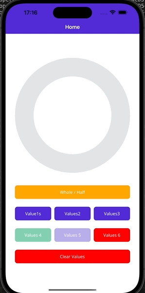

# PIE CHART MAUI
A component pie chart with animation and more.

The library consists of one NuGet packages:

[](https://www.nuget.org/packages/PieMaui/)

[Sample](https://github.com/pabloprogramador/Pie/tree/main/Pie.Sample)

To use, simply install the package and add use to your builder:
```javascript
var builder = MauiApp.CreateBuilder();
    builder
      .UseMauiApp<App>()
      builder.UsePie();
```



You can use the OpenView:
```html
xmlns:pie="clr-namespace:Pie;assembly=Pie"

    <pie:Pie x:Name="pgPie"
        IsHalfCircle="{Binding IsHalfCircle}"
        Values="{Binding Values}"
        PieColor="{Binding PieColor}"
        PieColors="{Binding PieColors}"
        HorizontalOptions="FillAndExpand"
        HeightRequest="400"
    />
```
